[return to index](https://released.github.io/)

<a id="article_top"></a>

# FAQ (Renesas)


* [How to get RH850 RLIN3 (UART) lowest error rate](#calculate_uart_baud_rate)

* [How to get RL78 slave PWM TDR/duty value](#calculate_RL_78_pwm_duty)

* [Notice about RH850/RL78 CAN](#notice_RH850_RL78_CAN)


---

<a id="calculate_uart_baud_rate"></a>

# How to get the lowest error rate according to current UART baud rate

* __RH850 RLIN3 (UART) clock max speed__

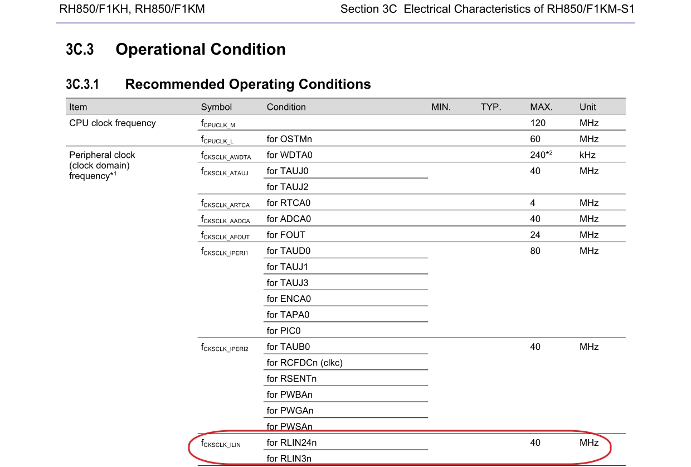

* __RH850 RLIN3 (UART) baud rate calculate formula__

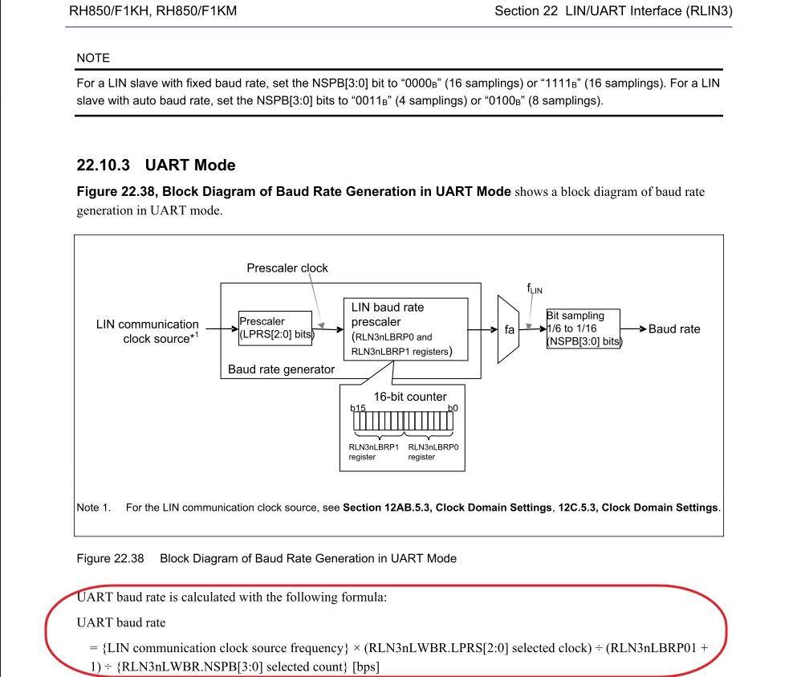


[back to top](#article_top)   

---

[download(python)](./python/RH850_uart_gui.pyw)

* __use tab 3:Best Match Finder, to get best match__

    * input target baud rate 
    * input target error rate
    * tool will try to find best match , base on freq : 
        * 8MHz,16MHz,20MHz,24MHz,40MHz,80MHz,96MHz,120MHz

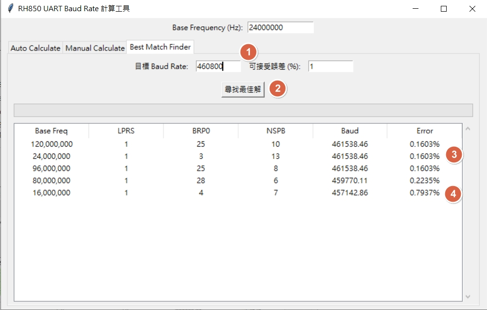

* __use tab 2:Manual Calculate, to calculate error rate__

    * input target Base Frequency 
    * input target LPRS/BRP0/NSPB 
    * input target baud rate 

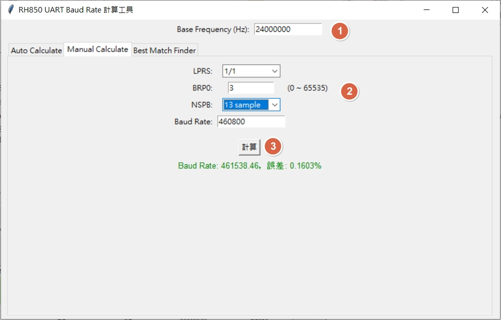


* __use tab 1:Auto Calculate, to calculate error rate__

    * input target Base Frequency 
    * input target baud rate 
    * input target display result 

below is error rate result , when Base Frequency:40MHz
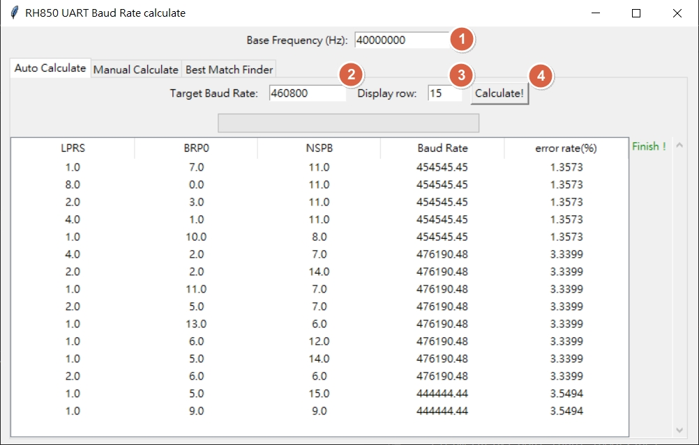

below is error rate result , when Base Frequency:24MHz
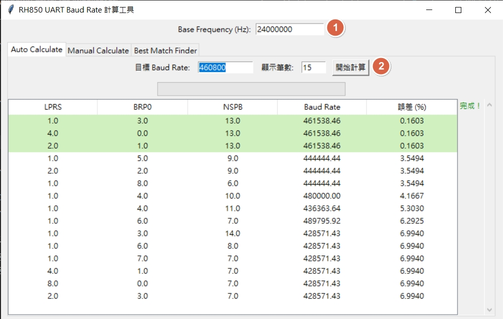

below is error rate result , when Base Frequency:16MHz
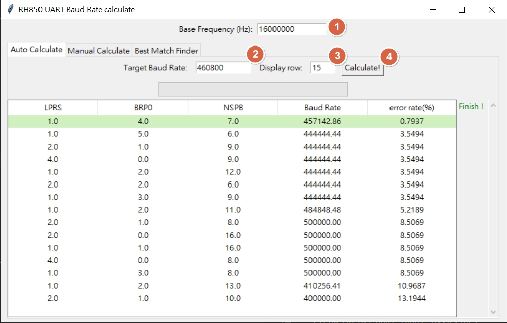

[back to top](#article_top)   

---


<a id="calculate_RL_78_pwm_duty"></a>

# How to get RL78 slave PWM TDR/duty value 

* __RL78 TDR formula__

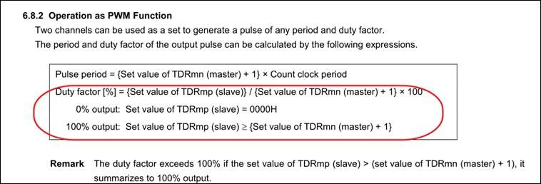


[download(python)](./python/RL78_pwm_gui.pyw)


* __use tab 1:manual input__

    * input pwm master TDR value (hex)
    * input pwm slave TDR value (hex) , to calculate duty
    * input pwm slave duty , to calculate slave TDR
    * select check box , to enable auto calculate master TDR

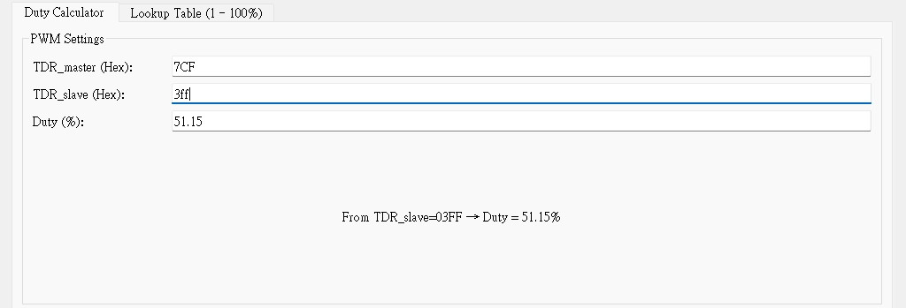
    
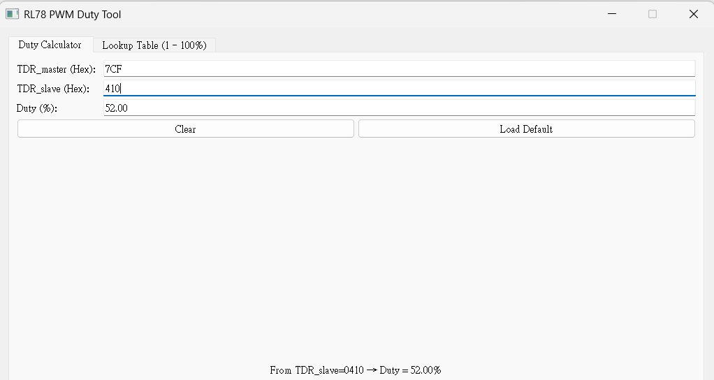
    
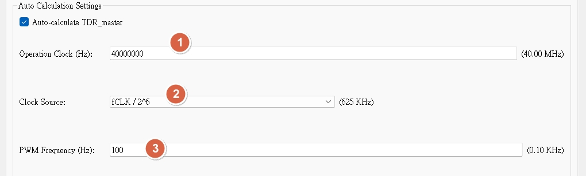


* __use tab 2:calculate all TDR/duty value__

    * input pwm master TDR value (hex)

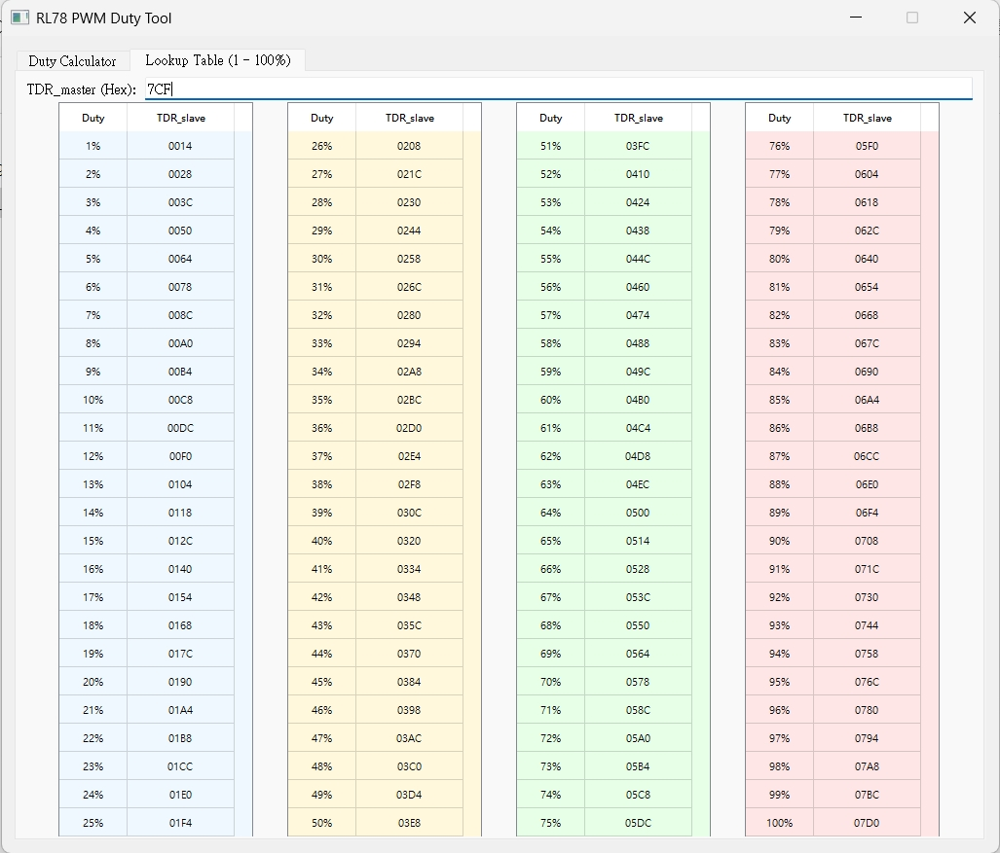

[back to top](#article_top)   

---


<a id="notice_RH850_RL78_CAN"></a>

# Notice about RH850/RL78 CAN module

<span style="color:#FF0000">
<b>* enable TDC when data phase with high baud rate</b><br><br>
</span>


* __TDC_in_RL78__

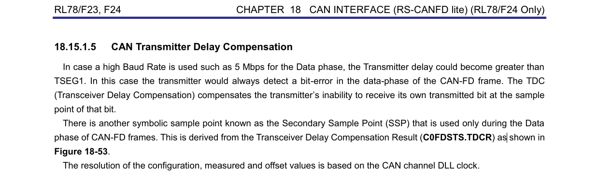

* __TDC_in_RH850__

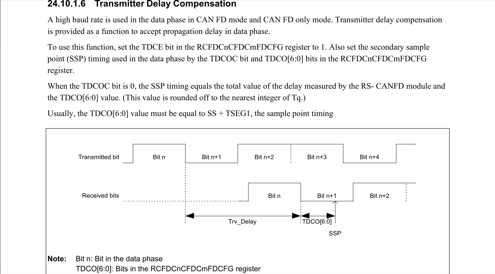


[back to top](#article_top)  

---

* __Nominal Bit Timing_in_RH850__

```
NTSEG1[6:0] Bits : 4 to 128 Tq
NTSEG2[4:0] Bits : 2 Tq to 32 Tq
NSJW[4:0] Bits : 1 to 32 Tq
```

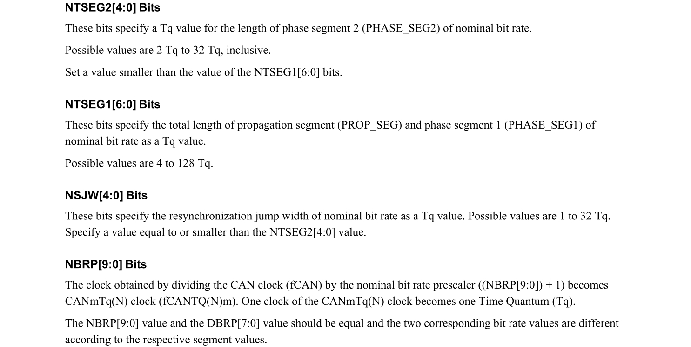
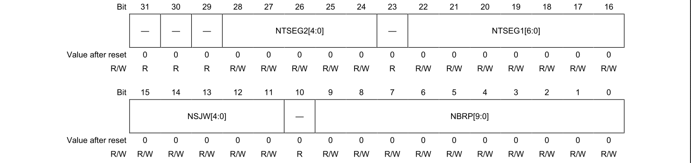


[back to top](#article_top)  

---

* __Data Bit Timing_in_RH850__

```
DTSEG1[3:0] Bits : 2 to 16 Tq
DTSEG2[2:0] Bits : 2 to 8 Tq
DSJW[2:0] Bits Bits : 1 to 8 Tq
```

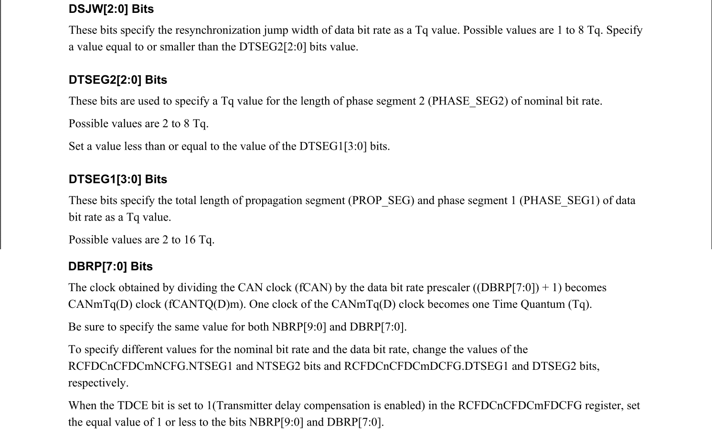
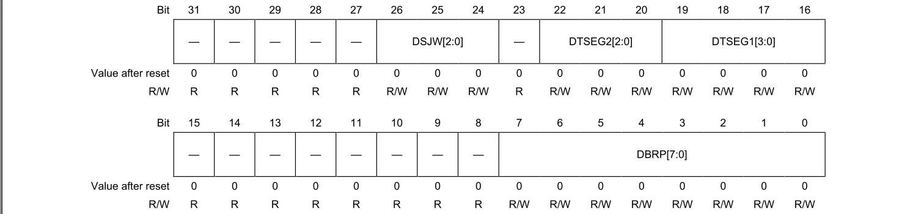

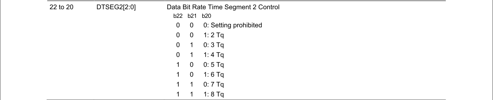
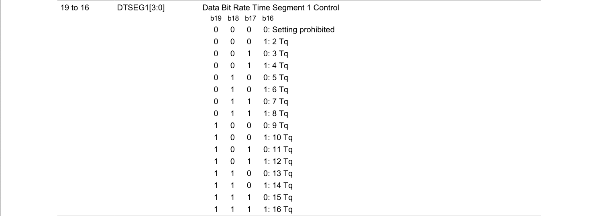


[back to top](#article_top)   

---

* __use tool to calcualte CAN FD timing__
[Bit-Rate-Calculation-Tool](https://www.peak-system.com/Bit-Rate-Calculation-Tool.496.0.html?&L=1)


* __use web site to calcualte CAN FD timing__
[bit-timing-calculator-can-fd](https://www.kvaser.cn/support/calculators/bit-timing-calculator-can-fd/)


* __Timing_setting_in_RH850__

<span style="color:#FF0000">
<b> 
* NBRP[9:0] = DBRP[7:0] </b><br>
<b> 
* when TDCE enable , NBRP[9:0] and DBRP[7:0] must equal vaule of 1 or less
</b><br><br>

</span>

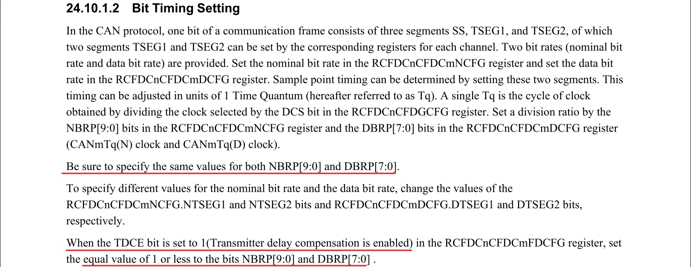

[back to top](#article_top)  

---


[Sample_Project_RH850_S1_CAN_FD_RX_Polling_No_Rule](https://github.com/released/Sample_Project_RH850_S1_CAN_FD_RX_Polling_No_Rule)


[Sample_Project_RH850_S1_CAN_FD_RX_Polling_No_Rule_5M](https://github.com/released/Sample_Project_RH850_S1_CAN_FD_RX_Polling_No_Rule_5M)


* __How_to_enable_TDC_in_RH850__

    * need to set ==__TDCE__== and ==__TDCOC__==
    * need to set ==__TDCO[6:0]__==
        * TDCO = SSP
    * add below code in ==__static void can_normal_mode_set(..)__==

```c
    CAN_REG_SET(cst2[channel].CxFDCFG.UINT32,CAN_REG_BIT9,CAN_REG_LENGTH_1);    // TDCE = 1
    CAN_REG_SET(cst2[channel].CxFDCFG.UINT32,CAN_REG_BIT8,CAN_REG_LENGTH_1);    // TDCOC = 1
    //The SSP offset value = (set value of TDCO[6:0] bits + 1). 
    CAN_REG_SET(cst2[channel].CxFDCFG.UINT32,CAN_REG_BIT16,6);   // TDCO[6:0] 
```


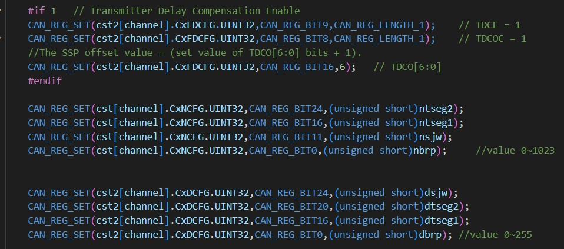

 * Below is PCAN tool setting to test 500K/5M 


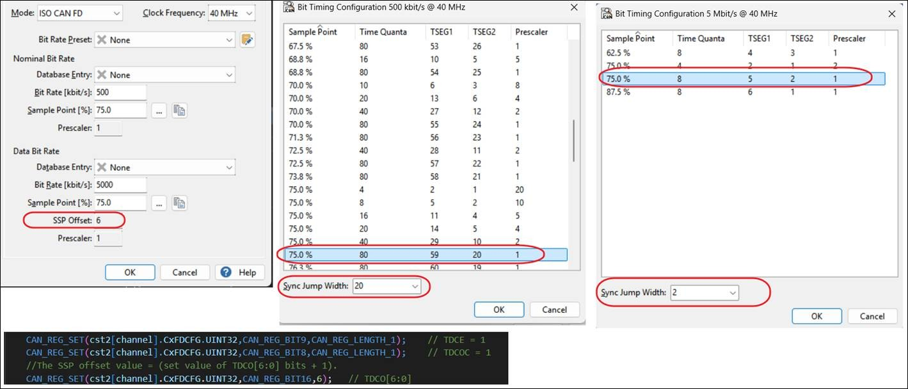


 * modify below code in ==__const CAN_BUS_PARAMETER_T can_bus_parameter_ch1__==
    
```c
    .NBRP                   = CAN_NBRP_1,
    .NTSEG1                 = CAN_NTSEG1_59TQ,
    .NTSEG2                 = CAN_NTSEG2_20TQ,
    .NSJW                   = CAN_NSJW_20TQ,

    .DBRP                   = CAN_DBRP_1,
    .DTSEG1                 = CAN_DTSEG1_5TQ,
    .DTSEG2                 = CAN_DTSEG2_2TQ,
    .DSJW                   = CAN_DSJW_2TQ,

```

```
    40MHz
    nominal : 500k
        sample rate : 75
        pre-scale : 1
        TSEG1 : 59
        TSEG2 : 20
        SJW : 20

    data : 5M
        sample rate : 75
        pre-scale : 1
        TSEG1 : 5
        TSEG2 : 2
        SJW : 5  
        
        SSP : 6

```

[back to top](#article_top)  

---

* __other Nominal Data Bit timing 1__
    * nominal : 500K , 75%
    * data : 2M , 75%

```c
    .NBRP                   = CAN_NBRP_1,
    .NTSEG1                 = CAN_NTSEG1_59TQ,
    .NTSEG2                 = CAN_NTSEG2_20TQ,
    .NSJW                   = CAN_NSJW_20TQ,

    .DBRP                   = CAN_DBRP_1,
    .DTSEG1                 = CAN_DTSEG1_14TQ,
    .DTSEG2                 = CAN_DTSEG2_5TQ,
    .DSJW                   = CAN_DSJW_5TQ,
```

```
    40MHz
    nominal : 500k
        sample rate : 75
        pre-scale : 1
        TSEG1 : 59
        TSEG2 : 20
        SJW : 20

    data : 2M
        sample rate : 75
        pre-scale : 1
        TSEG1 : 14
        TSEG2 : 5
        SJW : 5 

```


[back to top](#article_top)

---

* __other Nominal Data Bit timing 2__
    * nominal : 500K , 80%
    * data : 2M , 70%

```c
    .NBRP                   = CAN_NBRP_1,       //1U - 1U,
    .NTSEG1                 = CAN_NTSEG1_63TQ,  //63U - 1U,
    .NTSEG2                 = CAN_NTSEG2_16TQ,  //16U - 1U,
    .NSJW                   = CAN_NSJW_16TQ,    //16U - 1U,

    .DBRP                   = CAN_DBRP_1,       //1U - 1U,
    .DTSEG1                 = CAN_DTSEG1_13TQ,  //13U - 1U,
    .DTSEG2                 = CAN_DTSEG2_6TQ,   //6U - 1U,
    .DSJW                   = CAN_DSJW_6TQ,     //6U - 1U,
```

```
    40MHz
    nominal : 500k
        sample rate : 80
        pre-scale : 1
        TSEG1 : 63
        TSEG2 : 16
        SJW : 16

    data : 2M
        sample rate : 70
        pre-scale : 1
        TSEG1 : 13
        TSEG2 : 6
        SJW : 6
```


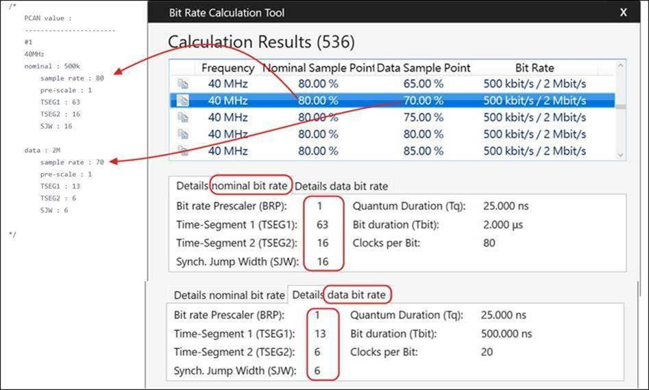

[back to top](#article_top)

---

* __How to set CAN frame or CAN FD frame__
    * modify CAN_FD_MODE_e mode to output classical CAN frame or CAN FD frame

```c
typedef enum
{
    CAN_FD_MIX_MODE=0,
    CAN_FD_ONLY_MODE=1,
    CAN_STANDARD_MODE=2
}CAN_FD_MODE_e;

```

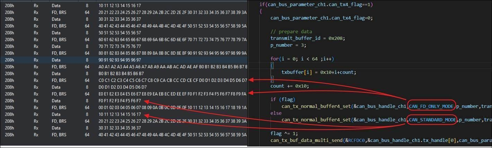

[back to top](#article_top)

---

* __Some example code__

[Sample_Project_RH850_S1_CAN_FD_RX_Polling_No_Rule](https://github.com/released/Sample_Project_RH850_S1_CAN_FD_RX_Polling_No_Rule)

[Sample_Project_RH850_S1_CAN_FD_RX_Polling_With_Rule](https://github.com/released/Sample_Project_RH850_S1_CAN_FD_RX_Polling_With_Rule)

[Sample_Project_RH850_S1_CAN_FD_RX_Interrupt_No_Rule](https://github.com/released/Sample_Project_RH850_S1_CAN_FD_RX_Interrupt_No_Rule)

[Sample_Project_RH850_S1_CAN_FD_RX_Interrupt_With_Rule](https://github.com/released/https://github.com/released/Sample_Project_RH850_S1_CAN_FD_RX_Interrupt_With_Rule)

[RL78_F24_CAN_FD](https://github.com/released/RL78_F24_CAN_FD)

[RL78_F24_CAN](https://github.com/released/RL78_F24_CAN)

[RL78_F13_CAN](https://github.com/released/RL78_F13_CAN)


[back to top](#article_top)
